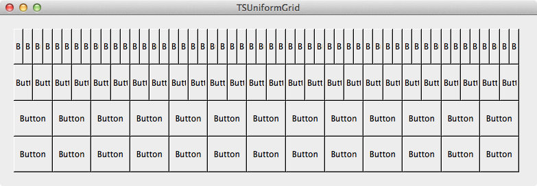

TSUniformGrid
============

`TSUniformGrid` is a simple uniform grid collection control for Cocoa. In many ways the view behaves like `NSStackView` except that all subviews are laid out to be a uniform size.

Subviews in the grid are sized in such away that the parent view is completely filled both horizontally and vertically. The average dimension, say the width, of any cell is simply`view-width / subview-count`. As the subviews are laid out they are integrally sized to achieve the desired overall average size. Adjacent subviews in the grid may therefore have non equal widths but the overall layout will remain as uniform as possible as the view size changes.

The grid is implemented as a subclass of a vertically configured `TSUniformStack`. The superclass can be used individually in situations where a simple uniform view stack is required.

See the sample project for more insight.

Usage
=====

Add `TSUniformGrid` and `TSUniformStack` to your Xcode project.
 
A grid is constructed from rows. Subviews are then added to the rows (instances of `TSUniformStack`). Rows may or may not have the same number of subviews. If they do then a true uniform grid will result.

	#import "TSUniformGrid.h"

	// Our nib contains an instance of TSUniformGrid
	// self.uniformGrid 

	// add a row with buttons
    NSMutableArray *subviews = [NSMutableArray arrayWithCapacity:52];
    for (int i = 0; i < 52; i++) {
        [subviews addObject:[NSButton new]];
    }
    [self.uniformGrid addNewRowWithSubviews:subviews];
    
	// add another
    [subviews removeAllObjects];
    for (int i = 0; i < 26; i++) {
        [subviews addObject:[NSButton new]];
    }
    TSUniformStack* row = [self.uniformGrid addNewRowWithSubviews:subviews];

	// add a subview to the end of a row
    [row addSubview:[NSButton new]];

Dynamic content
===============

It may be desirable to modify the grid content as the view is resized, say to add or remove subviews. The -`uniformGridWillResize:toSize:` delegate method can be used to repopulate the view prior to resizing the layout.

    #pragma mark -
    #pragma mark TSUniformGridDelegate

    - (void)uniformGridWillResize:(TSUniformGrid *)uniformGrid toSize:(NSSize)newSize
    {
        if (newSize.width == 0 || newSize.height == 0) return;
        
        CGFloat minAverageWidth = 180;
        CGFloat minAverageHeight = 160;

        // calculate the max number of rows and columns that can be displayed
        NSInteger maxColCount = (NSInteger)floor(newSize.width / minAverageWidth);
        if (maxColCount > MAX_CALENDAR_COLS) maxColCount = MAX_CALENDAR_COLS;
        if (maxColCount < 1) maxColCount = 1;
    
        NSInteger maxRowCount = (NSInteger)floor(newSize.height / minAverageHeight);
        if (maxRowCount > MAX_CALENDAR_ROWS) maxRowCount = MAX_CALENDAR_ROWS;
        if (maxRowCount < 1) maxRowCount = 1;
    
        // update the display if required
        if (maxRowCount != uniformGrid.rowCount | maxColCount != uniformGrid.columnCountInFirstRow ) {

            // suspend layout during bulk update
            self.uniformGrid.layoutSuspended = YES;

            [self updateGrid:0 rows:maxRowCount columns:maxColCount];

            self.uniformGrid.layoutSuspended = NO;
        }
    }

Auto Layout
===========

The grid does not use Auto Layout to implement its internal layout; it's quicker and simpler to compute the frames manually than it is to specify the required constraints. However, Auto Layout is supported for the subview interior layout and is the preferred means of performing subview layout.  

Build requirements
==================

OS X 10.9 64bit ARC

Licence
=======

MIT
